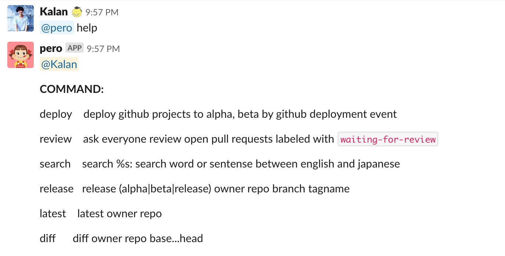
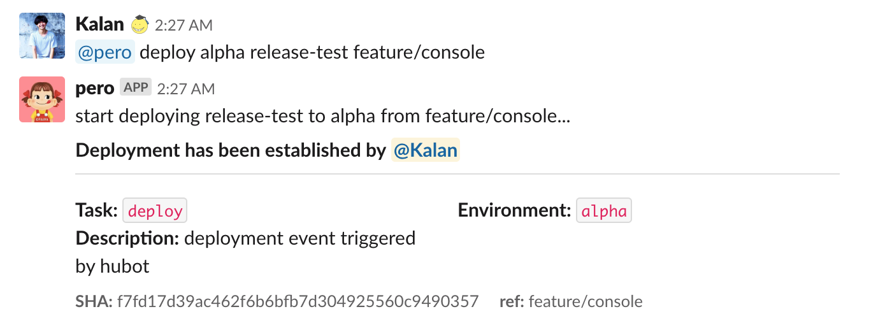
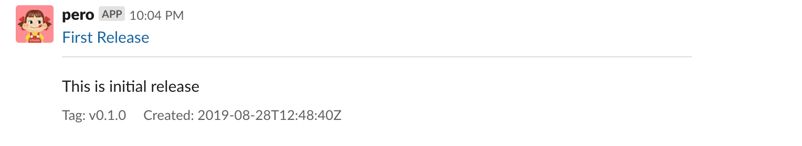
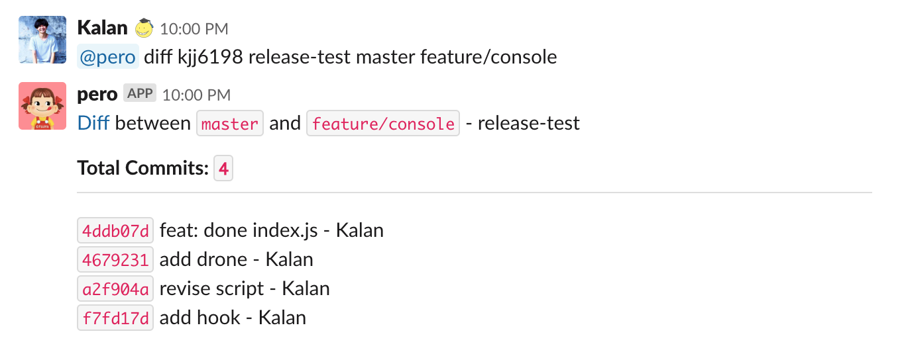

# Hubot Refined






## Motivation

_This is still under development, so use at your own risk._

[hubot-slack](https://github.com/slackapi/hubot-slack) is awesome. But it's too old and not actively maintained.

By default it'll do some user or channel fetching and store in cache under the hood, when slack users grows up, it always shows up rate limit message like [here](https://github.com/hubotio/hubot/issues/1384)

I created a small project for only using hubot like cli.

## Notable Features

- ✅ Extendable scripts
- ✅ Some useful built-in commands integrate with Github
- ✅ [Github deployment event](https://developer.github.com/v3/guides/delivering-deployments/)
- ✅ Can only run for certain users or channels by function
- ✅ Github Enterprise API supported

## What can I do with `slack-hubot`?

many. You can simplify your release process or your daily work within command, or even more! This section explains how hubot can do for you.

### 1. Add tag and release

To say you want to let planner and co-workers know what release version is, and which feature we did, it's helpful to display it on slack. When manually adding tag, we always forgot:

- What feature or issue we develop or fix
- Forgot to add tag after merged into master
- Forgot to add prefix `v` or some typo

With `@hubot release {phase} {owner} {repo} {branch} {version}` command, it'll create and and verify version number.

### 2. Deployment

It's always a pain to deploy. With github deployment event, you can trigger, verify, track deployment process on slack and github.


### 3. Ask for review

We always want everyone reviews, you can use `review` command to do it.

### 4. Your command!

It's easy to create your own comamnd, see [How to create a command](#how-to-create-a-command)

## Getting Started

```sh
npm install
cp .env.example .env # revise env value in .env
npm start
```

## Env setup

| env                 | description                                                                                     |                                       |
| ------------------- | ----------------------------------------------------------------------------------------------- | ------------------------------------- |
| HUBOT_SLACK_TOKEN   | hubot token generated from slack, will use this token to start rtm client                       |                                       |
| GITHUB_ACCESS_TOKEN | built-in command and lib will use this token to read, write your repository                     |                                       |
| GITHUB_API_BASE_URL | by default it uses github api, if you're using github enterprise, you can set this env variable | https://git.your-host-name.com/api/v1 |

**setup `GITHUB_API_BASE_URL` if you're using Github enterprise.**

You can type `@hubot help` to see possible command.

## How to create a command

If you want to create a custom command:

1. create a `.ts` or `.js` file
2. export a object follow by `Command` shape

**Example:**

```typescript
// mycommand.ts

const script: Command = {
  name: 'search', // your command name
  description: 'search english word', // simple description to describe what this command does
  command: /search\s+([^ ])/, // how to trigger command, when using RegExp, it'll match the message which fits RegExp
  action: (matches, message, client) => {} // matches is from `command` you set. message is an original message, client is client from client.ts
  isAuthedUser: (userId, message, client) => true, // if this command only can only be running for certain users, you can use this function
  enableChannels: () => true, // if you only want command running in certain channels, you can add this function
};

export default [script];
```

| Name           | Description                                                                   |                                                                      |
| -------------- | ----------------------------------------------------------------------------- | -------------------------------------------------------------------- |
| command        | string \| RegExp                                                              | the command you want to listen                                       |
| action         | `(match, message: RawSlackMessage, client: SlackClient) => void;`             | when message match the command pattern, it'll call action function.  |
| name           | string                                                                        | your command name, used by help command                              |
| description    | string                                                                        | simple description, used by help command                             |
| enableChannels | `(message: RawSlackMessage, client: SlackClient) => boolean;`                 | Hubot will use this function to see if it's permitted to use command |
| author         | () => string                                                                  | Author name, used by @help                                           |
| isAuthedUser   | `(userId: string, message: RawSlackMessage, client: SlackClient) => boolean;` | To see if user can use this command                                  |

1. Add it in `scripts/index.js` file
2. You can run `npm start` locally to see result.

## Built-in commands

- `deploy`: deploy github project by triggering github deployment event
  
- `review`: list github pull request labeled with `waiting-for-review`
- `release`: create a release, will check version number first under the hood.
- `latest`: get a latest release and reply to slack, useful when planner or someone who wants to see current version application.
  
- `diff`: Compares two ref and reply to slack.
  

## Slack block

Slack introduces the [Block Kit](https://api.slack.com/block-kit) recently that offers you more flexibility to construct message. In slack-hubot-refined, you can use jsx-like way to construct blocks, which is handy and easy.
Internally use [htm](https://www.npmjs.com/package/htm) under the hood, you can check `services/SlackBlock.ts` for more details.

Its idea is originally coming from [kevin940726](https://github.com/kevin940726/daily/tree/master/app/slack-block-kit), it inspires me a lot.

Here is an example:

```javascript
import block from '../services/SlackBlock';
const component = block`
  <p>
    <b>Deployment has been established by <mention id="${
      deployment.payload.user.id
    }" type="user" /></b>
  </p>
  <hr />
  <fields fields=${block`
    <t><b>Task:</b> \`${deployment.task}\` <br/></t>
    <t><b>Environment:</b> \`${deployment.environment}\` <br/></t>
    <t><b>Description:</b> ${deployment.description}</t>
  `} />
  <context elements=${block`
    <t>*SHA:* ${deployment.sha}</t>
    <t>*ref:* ${deployment.ref}</t>
  `} />
`;
```

will output to slack blocks format like:

```json
[
  {
    "type": "section",
    "text": {
      "type": "mrkdwn",
      "text": "*Deployment has been established by <@deployment.payload.user.id>*"
    }
  },
  { "type": "divider" },
  {
    "type": "section",
    "fields": [
      { "type": "mrkdwn", "text": "*Task:* ${deployment.task} \n" },
      { "type": "mrkdwn", "text": "*Environment:* ${deployment.environment} \n" },
      { "type": "mrkdwn", "text": "*Description:* ${deployment.description} \n" }
    ]
  },
  {
    "type": "context",
    "elements": [
      { "type": "mrkdwn", "text": "*SHA:* ${deployment.sha}" },
      { "type": "mrkdwn", "text": "*ref:* ${deployment.ref}" }
    ]
  }
]
```

### Supported tags

| Tag     | props                  | description                                               |
| ------- | ---------------------- | --------------------------------------------------------- |
| a       | href                   | like normal a tag. `<a href="xxx">xxx</a>`                |
| section | `useMarkdown: boolean` | `<section/>`                                              |
| p       |                        | markdown text supported. `<p>text</p>`                    |
| b       |                        | syntax sugar for `*text*`, should be wrapped in `p` tag   |
| i       |                        | syntax sugar for `_text_`, should be wrapped in `p` tag   |
| text    |                        | same as `p` tag currently                                 |
| t       |                        | create pure text, only use it inside `field` or `context` |
| img     | src, title, alt        | ``                           |
| br      |                        | syntax sugar for `\n`                                     |
| hr      |                        | `</hr>` equals slack block `{ type: 'divider' }`          |
| context | elements: array        | ` <context elements=${block``} /> `                       |
| fields  | fields: array          | ` <fields fields=${block``} /> `                          |
| mention | id, type               | syntax sugar for `<@userId>` or `<#channelId>`            |

Currently `jsx-like` way is not really well test and need to revise for nested usage. So please use it carefully.

### Write a component

This section describes how to write a component, if you're familiar with react, it's very easy to you.

1. create a function that receives props as parameter
2. return a jsx-like syntax wrapped with `block`

```javascript
import block from 'path/to/services/SlackBlock';

const Help = ({ scripts }) => {
  const commands = scripts
    .filter((s: Command) => s.name || s.description)
    .map((s: Command) => `${s.name}   ${s.description}`);

  const alignedCommands = alignText(commands).map(
    s => block`
        <p>${s}</p>
      `
  );

  return block`
    <p><strong>COMMAND: </strong></p>
    ${alignedCommands}
  `;
};
```

```javascript
// in your command
const component = block`
  <${Help} scripts=${[...]} />
  <p>By <b>author</b></p>
`;

client.send(message.channel, '', component);
```

## Roadmap

- [ ] Supports another useful event type like `reaction_added` or `file_uploaded`
- [ ] Add adaptor for easily debugging
- [ ] Make command and response more configurable
- [ ] Interactive API

## LICENSE

MIT
